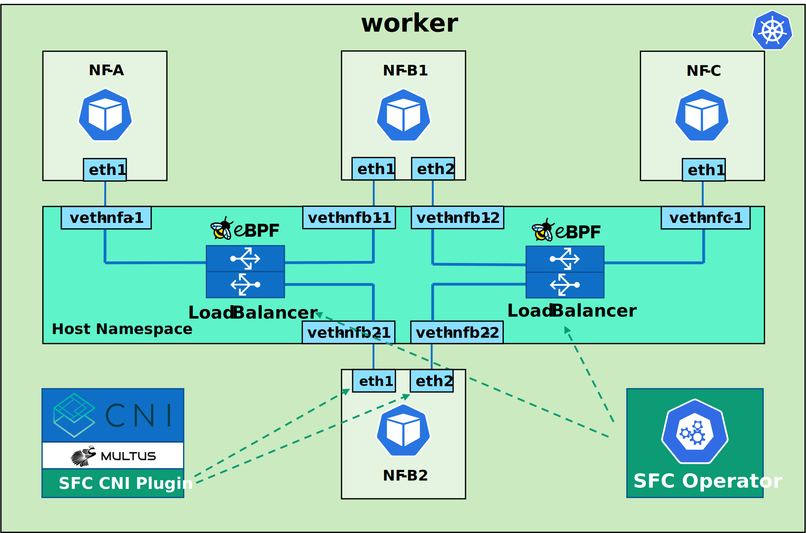

# sfc-k8s

``sfc-k8s`` is a system that enables **scalable** Service Function Chains (SFCs) in **Kubernetes**. 

It **seamlessly** leverages the dynamic **autoscaling features** of the orchestrator allowing each Network Function (NF) Pod of a SFC to be independently scaled in an **arbitrary** number of replicas. 

In order to do that, it provides **flexible cross-connections** between adjacent NFs instances in the chains. These cross-connections, based on the **eBPF** technology, provide traffic forwarding capabilities and all the necessary **load balancing** logic to distribute the traffic among the NF replicas they are connected to.

Furthermore, it extends Kubernetes introducing **custom resources** and **operators** to support the managing of SFCs in a **fully declarative** way.

## Architecture

The ``sfc-k8s`` system architecture is composed of:

* **CNI plugin**: this is the component that configures the additional **data plane** interfaces required by the NF Pods in the SFCs. It has been designed to operate
in conjunction with **Multus CNI**. It configures *veth* pairs that connect the Pods with the *network namespace* of the host on which they are scheduled. The configuration of the main interface that connects the NF Pods to the cluster network is delegated to the default plugin

* **Load Balancers**: these are the components that implement the **cross-connection** between adjacent NFs and that enable the distribution of the traffic among the available replicas. Each instance is **two-sided** and **bidirectional**, i.e., it can only manage traffic between two consecutive NFs, with packets that can flow in both directions. Their implementation is based on **eBPF** which allows to process the traffic on its natural path inside the Linux network stack. These load balancers handle the traffic between adjacent NFs, irrespective of the actual number of replicas. Hence, they implement an *N-to-M* cross-connection between all *veth* interfaces associated to these NFs in the SFC, which terminate in the host network namespace.

* **Operator**: this is the component that act as a **manager** for the system implementing the *Operator Pattern* of Kubernetes. It provides all the logic to manage the **lifecycle** of the SFCs and to seamlessly adapt them to the dynamic **scaling events** regarding NF replicas. In particular it acts as a controller for a custom resource named *ServiceFunctionChain* allowing the instantiation of SFCs starting from a declarative logical description. In addition, it watches Kubernetes resources representing NF Pods in order to immediately detect if there is a new replica or an existing one is going to be deleted, and it acts as a **control plane** for the load balancers in order to keep them aligned to work with the NFs replicas present at the moment. The implementation of the Operator is based on **Kopf** framework.

